<p align="center">
  
</p>

<br/>

```
lysander@research:~$ cat research_interests.txt
```

I build computational tools at the intersection of **genomics** and **machine learning** — focused on
understanding how genetic variation drives complex traits and disease through data-driven approaches.

Currently exploring how epigenomic landscapes (chromatin accessibility, histone modifications) can be
integrated with GWAS signals to identify causal variants and cell-type-specific regulatory mechanisms.

---

### Research Focus

```
                 GWAS Summary Stats
                        |
                  [ SNP Mapping ]
                   /          \
       Chromatin Peaks    Expression Data
               \              /
            [ ML Integration Layer ]
                        |
              Variant Prioritization
```

**Genomic Variant Analysis** -- Mining GWAS catalogs to map trait-associated SNPs across the genome,
computing per-chromosome density profiles, and cross-referencing with chromatin accessibility data to
identify functional regulatory elements.

**Epigenomic Signal Integration** -- Overlaying cell-type-specific peak data (ATAC-seq, ChIP-seq) with
genetic association signals to pinpoint variants that fall within active regulatory regions.

**Computational Pipeline Development** -- Building reproducible analysis tools that bridge the gap
between raw association data and biological interpretation.

---

### Research Projects

| Repository | Description |
|:-----------|:------------|
| [gwas-snp-analysis](https://github.com/1ysander/gwas-snp-analysis) | Genomic variant analysis pipeline — maps 107 pain-associated SNPs against 222 cell-type cCRE peak sets, computes chromosomal density profiles, and identifies cell types enriched for regulatory variants |

---

### Other Projects

| Repository | Description |
|:-----------|:------------|
| [conversation-capture](https://github.com/1ysander/conversation-capture) | Apple Watch + iPhone app for AI-powered conversation transcription, summarization, and semantic Q&A |
| [projectly](https://github.com/1ysander/projectly) | Shipping management web app — React, Vite, Supabase |
| [ecomm-pricing-calculator](https://github.com/1ysander/ecomm-pricing-calculator) | Dynamic pricing & margin calculator for e-commerce — models non-linear fulfillment costs, zone-based shipping, and real-time margin analysis |
| [projects](https://github.com/1ysander/projects) | Collection of small utility scripts — action-item extraction, estimation, report summarization, status reports |

---

### Stack

```python
class ResearchToolkit:
    genomics    = ["Python", "Pandas", "BioPython", "Bedtools"]
    ml          = ["PyTorch", "scikit-learn", "NumPy", "SciPy"]
    engineering = ["Swift", "TypeScript", "React", "Supabase"]
    data        = ["PostgreSQL", "CSV/TSV pipelines", "matplotlib"]
```

---

### Currently

- Studying Computer Science at **Washington University in St. Louis**
- Building genomic analysis pipelines for pain-associated GWAS variants
- Exploring ML methods for variant effect prediction and cell-type deconvolution

---

<p align="center">
  
</p>

<p align="center">
  <sub>
    &#x2500;&#x2500;&#x2500; ATCG &#x00b7; GCTA &#x00b7; TGCA &#x2500;&#x2500;&#x2500;
  </sub>
</p>
