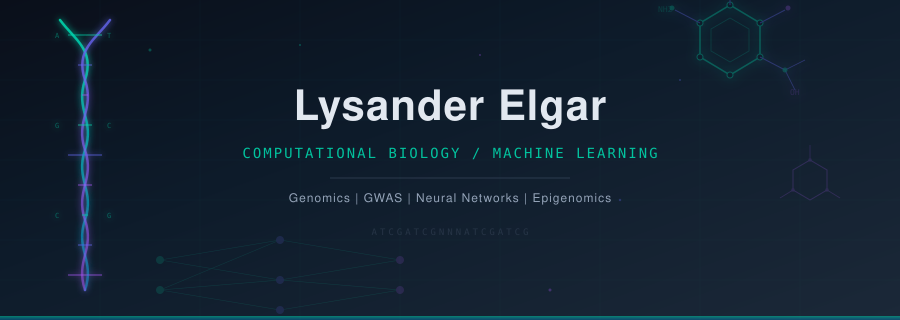

  

I'm an undergraduate researcher at **Washington University in St. Louis** building
computational tools for spatial biology, genomics, and machine learning. I care about
reproducible analysis, honest uncertainty, and results that other people can inspect.

---

### Research

#### CosMx-mDRG spatial transcriptomics

`Spatial transcriptomics` · `R/Seurat` · `DRG biology`

I analyze **34,540 cells from 37 L4 dorsal-root ganglia across 20 mice** with the
Chamessian Lab. I build workflows for atlas-based cell-type annotation, unsupervised
clustering, section-aware spatial statistics, validation, and reproducible figures.
The research repository and source data are private.

#### TCR network topology and kidney allograft rejection

`Immune repertoire` · `Network science` · `Predictive modeling`

I joined a Borcherding Lab project for a major manuscript revision examining whether
pre-transplant TCR-beta sequence-similarity network structure predicts kidney allograft
outcomes independently of HLA mismatch. I am rerunning and stress-testing the analysis,
incorporating an additional external cohort, evaluating statistical and machine-learning
extensions, and helping revise the figures and manuscript. The code and patient-level
data are private. [Read the earlier manuscript version](https://pmc.ncbi.nlm.nih.gov/articles/PMC13174407/).

---

### Hackathons

#### [Argus — emergency intake and dispatch-support prototype](https://github.com/cifyr/argus)

A team-built local macOS console that combines Messages, Find My, Ollama, SQLite, and
OpenStreetMap to surface emergency messages, medical context, location, and dispatch
contact information for a human operator. Argus assists the operator; it does not
autonomously contact 911.

#### Sepsis Early Warning

A four-person prototype combining a clinical dashboard, FastAPI services, a RandomForest
trained on synthetic patient trajectories, and Gemini-generated nurse-facing explanations.
The hosted demo uses fixture data; the model and agent path runs locally.

---

### Other work

- **Pain-associated GWAS variants x cell-type regulatory elements** — exploratory Python
  analysis comparing 107 cataloged variants with 222 cell-type cCRE peak sets.
- **Conversation Capture** — privacy-aware product architecture for an Apple Watch and
  iPhone transcription, summarization, and semantic Q&A system; implementation in progress.
- **Projectly** — full-stack shipping-workflow prototype built with TypeScript, React,
  Vite, and Supabase.

---

### Toolkit

`R` · `Seurat` · `ggplot2` · `Python` · `scikit-learn` · `TypeScript` · `React` ·
`FastAPI` · `SwiftUI` · `Supabase` · `Git`
